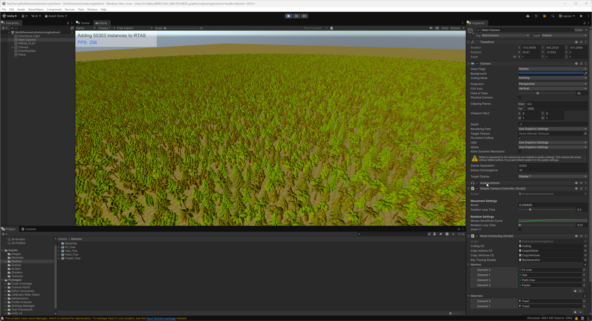
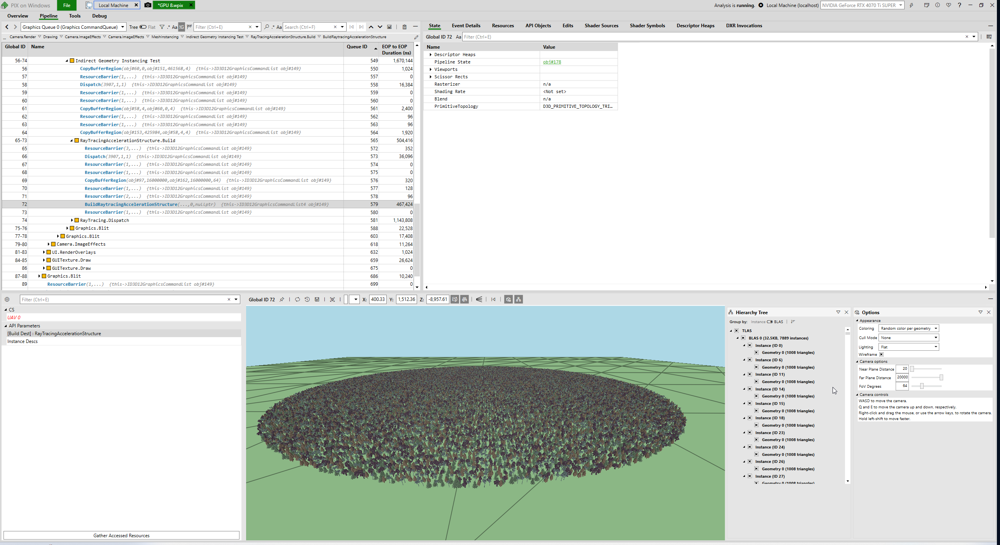

# `AddInstancesIndirect<T>`
Test project that uses [`RayTracingAccelerationStructure.AddInstancesIndirect<T>`](https://docs.unity3d.com/6000.3/Documentation/ScriptReference/Rendering.RayTracingAccelerationStructure.AddInstancesIndirect.html) to configure, in a single call, many ray tracing instances that use different geometries and materials.



Method signatures:

```
int RayTracingAccelerationStructure.AddInstancesIndirect<T>(RayTracingMultiGeometryInstanceConfig config, GraphicsBuffer instanceData, GraphicsBuffer instanceIndices, int maxInstanceCount, GraphicsBuffer argsBuffer, uint argsOffset, uint id)
int RayTracingAccelerationStructure.AddInstancesIndirect(RayTracingMultiGeometryInstanceConfig config, GraphicsBuffer instanceData, Type instanceType, GraphicsBuffer instanceIndices, int maxInstanceCount, GraphicsBuffer argsBuffer, uint argsOffset, uint id)
```

The user can specify custom instance data using the instanceData `GraphicsBuffer` that stores per instance data. The instance data format is described by passing a simple structure as generic type template argument `<T>`. This structure can have any format and fields but it must contain the following mandatory fields: objectToWorld(Matrix4x4), geometryIndex(uint) and materialIndex(uint). The materials and geometries are configured using the method argument `RayTracingMultiGeometryInstanceConfig config`. This is how the <T> custom instance data structure can look like:

```
public struct RayTracingPerInstanceData
{
    public Matrix4x4 objectToWorld;
    public Vector3 color;
    public uint materialIndex;
    public uint geometryIndex;
    public float otherData;
};
```

The instance data and the optional instance indices are used both for building the ray tracing acceleration structure (TLAS, which needs the objectToWorld instance matrix and the geometry and material indices) and also in hit shaders. The instance data GraphicsBuffer is bound as `ByteAddressBuffer unity_UserInstanceData_RT;` and the instance indices GraphicsBuffer is bound as `StructuredBuffer<uint> unity_UserInstanceDataInstanceIndices_RT;`. Check `UnityRayTracingMeshUtils.cginc` shader include in the Editor instalation folder for more details on how the vertex attributes and vertex indices are read when using custom instance data.

The source mesh data (the 4 tree Meshes) is copied into a common vertex and index buffer using 2 compute shaders: [CopyVertices.compute](Assets/Shaders/CopyVertices.compute) - copies vertices from Mesh assets into the common vertex buffer and [CopyIndices.compute](Assets/Shaders/CopyIndices.compute) - copies indices from Mesh assets into the common index buffer.
For each of the 4 trees, a geometry range is configured into [RayTracingMultiGeometryInstanceConfig.subGeometries](https://docs.unity3d.com/6000.3/Documentation/ScriptReference/Rendering.RayTracingMultiGeometryInstanceConfig-subGeometries.html)

The project performs a GPU culling step in a [compute shader](Assets/Shaders/Culling.compute) outputing a buffer of indices of instances that are inside a radius around the camera. The final amount of valid ray tracing instances must be written into the indirect arguments GraphicsBuffer which contains 2 integers at an offset: start instance, instance count. In this test, these values are 0 and the amount of instances that passed the culling test. 

`AddInstancesIndirect<T>` has minimal CPU performance impact on the render thread. When adding individual ray tracing instances using other `AddInstance` methods or using `CullInstances`, the render thread prepares one shader record for each ray tracing instance. When using `AddInstancesIndirect<T>`, the render thread will prepare one shader record for each Material specified in the [RayTracingMultiGeometryInstanceConfig.materials](https://docs.unity3d.com/6000.3/Documentation/ScriptReference/Rendering.RayTracingMultiGeometryInstanceConfig-materials.html) array.

The acceleration structure visualization tool in PIX:


# Requirements
Unity 6.3 beta1 +
